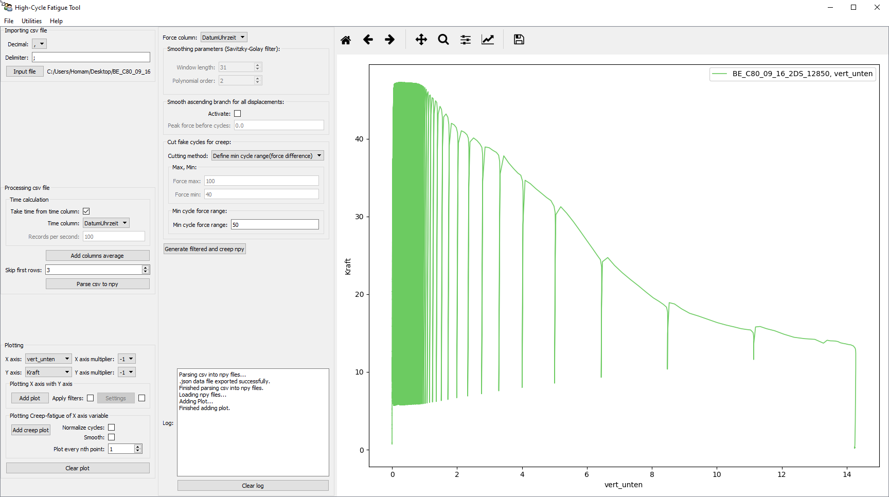
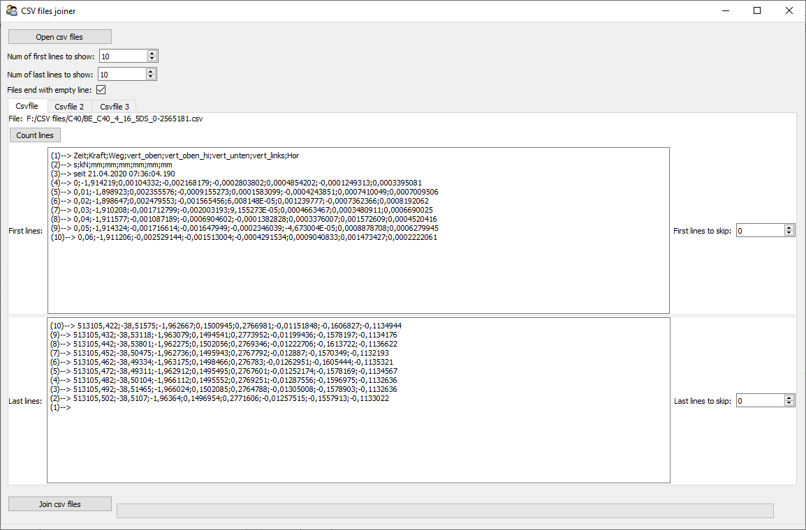

# High-Cycle-Fatigue-Tool (HCFT)
A tool with GUI (Graphical User Interface) for processing CSV files obtained from fatigue experiments up to the high-cycle fatigue ranges. Additionally, tests with monotonic loading can be processed.

## Features:
1. Simple plot functionality for columns of the CSV file.
2. Extracting Max and Min values and filtering the undesired cycles.
3. Extracting and plotting the fatigue creep curve (cycles number vs displacement).
4. Smoothing function for fatigue creep curves.
5. Ability to process file with +20 Gb size.
6. Additional built-in tool for viewing or joining huge CSV (or TXT) files (CSVJoiner).
7. Graphical User Interface with all functions and parameters

## Usage:
<ul>
 <b>Option 1 (Installing Python environment with all needed libraries)</b> 
<ul>
<li>
Install Miniconda <a href="https://docs.conda.io/en/latest/miniconda.html">(download link)</a>.</li>

<li>Run each of the following commands in Anaconda Command Prompt to install the required libraries:

`conda install -c conda-forge matplotlib`

`conda install -c conda-forge scipy`

`conda install -c conda-forge pandas`

`conda install -c conda-forge traits`

`conda install -c conda-forge traitsui`

</li>

<li>Clone this repository or download its contents
</li>

<li>Run the tool using the command

`python PATH_TO_THE_TOOL_REPOSITORY_FOLDER_ON_YOUR_PC/main.py`

</li>
</ul>

 

<li><b>Option 2 - Direct install from an installer exe file</b>
 
(<i>Note: Although this packed version includes all the important functions of the tool, this is not the most up-to-date version and might show more bugs!)</i>
 
Windows 64bit: <a href="https://github.com/ishomam/high-cycle-fatigue-tool/releases/download/v1.0/hcft_v1.0_64bit.exe">hcft_v1.0_64bit.exe
</a>

Windows 32bit: <a href="https://github.com/ishomam/high-cycle-fatigue-tool/releases/download/v1.0/hcft_v1.0_32bit.exe">hcft_v1.0_32bit.exe
</a>
</li>
</ul>

## Cite with: 
The repository can refered to using a unique doi hosted at https://zenodo.org

## Screenshots:

