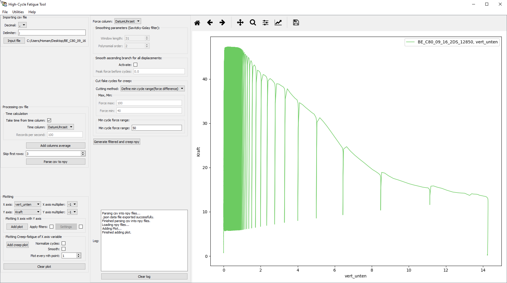
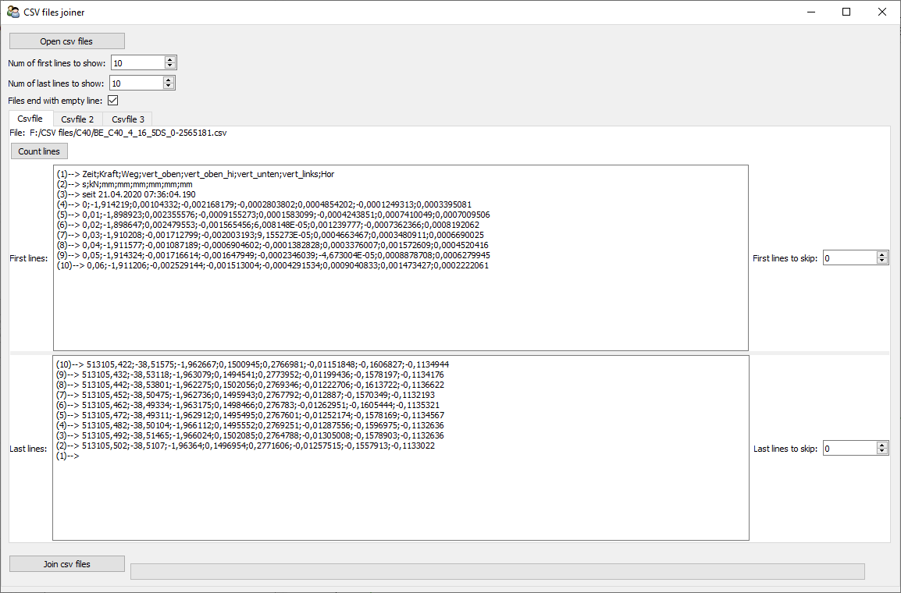

# High-Cycle-Fatigue-Tool (HCFT)
A tool with GUI (Graphical User Interface) for processing CSV files obtained from fatigue experiments up to the high-cycle fatigue ranges. Additionally, tests with monotonic loading can be processed.

## Features:
1. Simple plot functionality for columns of the CSV file.
2. Extracting Max and Min values and filtering the undesired cycles.
3. Extracting and plotting the fatigue creep curve (cycles number vs displacement).
4. Smoothing function for fatigue creep curves.
5. Ability to process file with +20 Gb size.
6. Additional built-in tool for viewing or joining huge CSV (or TXT) files (CSVJoiner).
7. Graphical User Interface with all functions and parameters

## Installation & usage

### Option 1 (recommended): run from source with [uv](https://docs.astral.sh/uv/)

uv is a fast Python package and project manager. It installs the right Python version and all the dependencies for you, so you don't need Python installed beforehand.

1. **Install uv** (one time only):

   - Windows (PowerShell):
     ```powershell
     powershell -ExecutionPolicy ByPass -c "irm https://astral.sh/uv/install.ps1 | iex"
     ```
   - macOS / Linux:
     ```bash
     curl -LsSf https://astral.sh/uv/install.sh | sh
     ```

   Afterwards, open a new terminal so that the `uv` command is available.

2. **Get the code**:
   ```bash
   git clone https://github.com/bmcs-group/high_cycle_fatigue_tool.git
   cd high_cycle_fatigue_tool
   ```
   (Or download the repository as a ZIP file, extract it and open a terminal in that folder.)

3. **Run the tool**:
   ```bash
   uv run hcft
   ```
   On the first run, uv downloads Python and creates a local `.venv` folder with all the required libraries. Later runs start immediately.

To update to the latest version, run `git pull` and then `uv run hcft` again. uv updates the environment automatically.

<details>
<summary>Other ways to use the tool</summary>

- **With conda**, if you prefer it:
  ```bash
  conda env create -f environment.yml
  conda activate hcft_env
  python main.py
  ```
- **With plain pip**: `pip install .` in the repository folder, then run `hcft`.

</details>

### Option 2: Windows installer (old version)

- Windows 64-bit: [hcft_v1.0_64bit.exe](https://github.com/bmcs-group/high_cycle_fatigue_tool/releases/download/v1.0/hcft_v1.0_64bit.exe)
- Windows 32-bit: [hcft_v1.0_32bit.exe](https://github.com/bmcs-group/high_cycle_fatigue_tool/releases/download/v1.0/hcft_v1.0_32bit.exe)

## For developers

- `uv sync` creates or updates the `.venv` environment from `uv.lock`.
- `uv add <package>` adds a new dependency to `pyproject.toml` and `uv.lock`.
- `uv build` builds the source distribution and the wheel into `dist/`, and `uv publish` uploads them to PyPI.
- To release a new version, update `hcft/version.py`, then tag the commit (`git tag v<version>` and `git push --tags`).
- To build the Windows exe and installer, install [Inno Setup 6](https://jrsoftware.org/isinfo.php) and run `packaging\windows\build.bat`. The results are written to `dist\`. See [packaging/windows/README.md](packaging/windows/README.md) for details.
## Cite with: [](https://doi.org/10.5281/zenodo.3603816)
The repository can refered to using a unique doi hosted at https://zenodo.org


## Screenshots:



